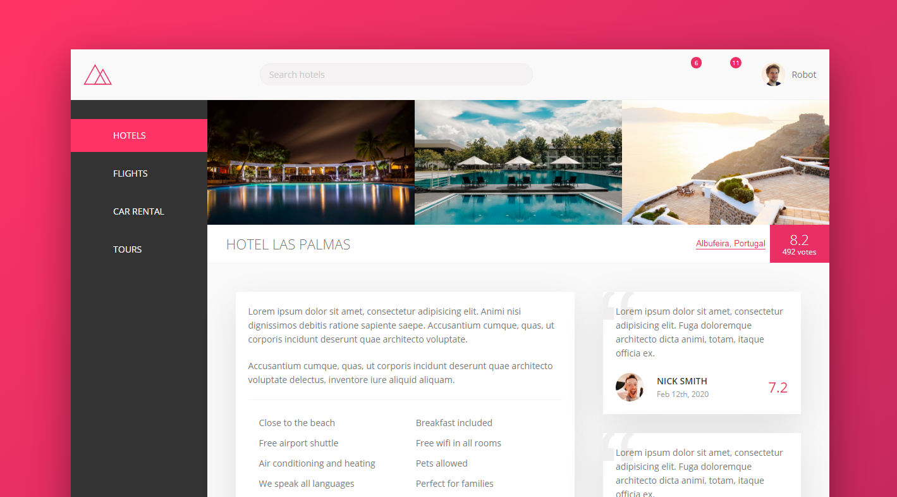

# Trillo-Project
Trillo project is a part of Jonas schemdtman Advanced CSS course. 
This Project is mainly focused on CSS3 Flex-box and Responsive design.

## live Demo
Live Demo here: https://ourandco.github.io/Trillo-Project/

### Languages
- HTML5
- CSS3

### Resources
- Google fonts 
- icomoon.io(svg icons) 
- cubic-bezier.com 
- caniuse.com  

## Getting Started

To get a local copy up and running follow these simple example steps.

### Setup

1. Clone this repo to your computer using `git clone`
2. Run `npm install` to install all the dependencies.
3. Open index.html from the dist folder on the local Live server to run the app.

##### Sass, NPM, BEM METHADOLOGY, Live-Sever

#### Student
:bust_in_silhouette: Alamgir

#### Author
:bust_in_silhouette: Jonas Schemdtman
